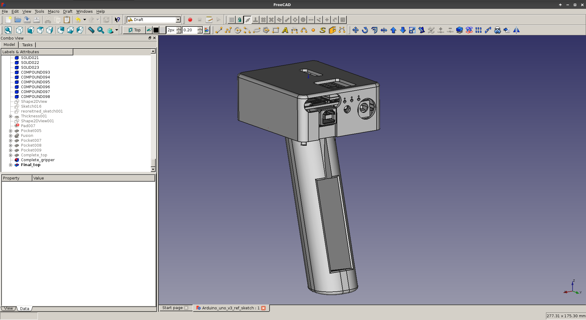
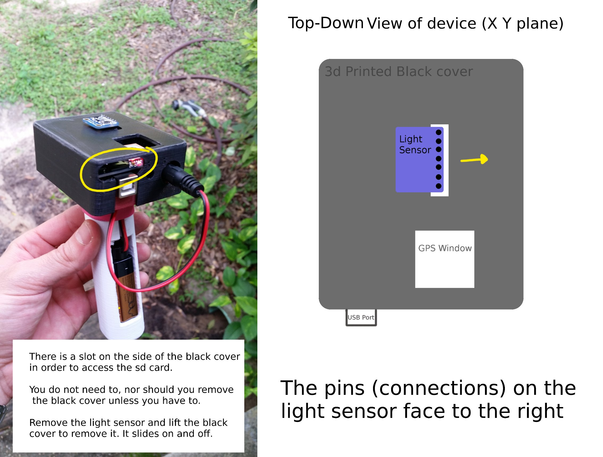

# Pistol-Grip-GPS-Logger
This is a 3dprinted case solution that I came up with to repair a datalogger used in sea turtle research. The seat of this case is designed to fit an Arduino Uno v3 microcontroller board.
For reasons of copyright I cannot post the source code, however the code is very simple and written from standard libraries.

## Files Present

* There are a few reference images that should reveal the basic construction of the device. 
* The stl 3D model files
* !Pleases accomodate the sizing to your 3d printer!

